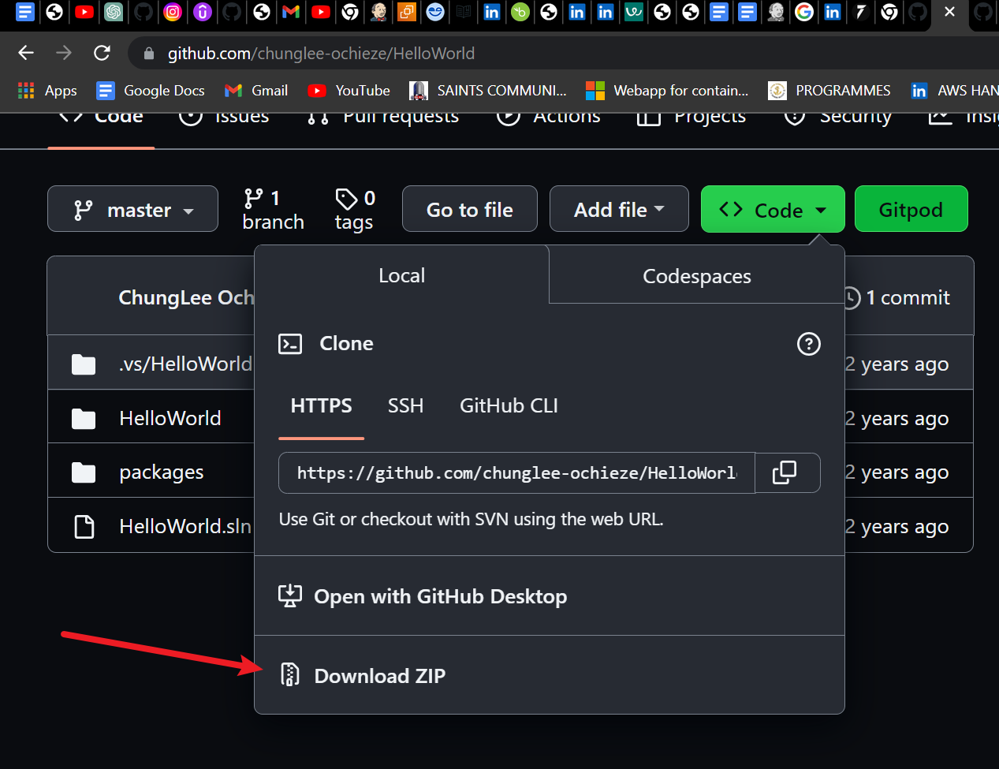

## Business Case Study: Implementation of CI-CD for Hello World 

Myworks.xyz is a leading commercial bank in Nigeria with a strong reputation for service excellence, alternative delivery channel platform, strong corporate governance, top of the range IT infrastructure, and wide network expansion. The company has a presence in Africa, the UAE, China, USA, and the United Kingdom. The company has about 12,000 users using the Core business system and about 790 branches across the country.

The company has identified an issue around it’s solution delivery process and time-to-market and has commenced the adoption of Agile DevOps to address this issue. You have been hired as an Analyst, DevOps automation and your job include the setting up of CI-CD pipelines for upcoming projects. Details of your immediate task is as below 

1.	Download the code for “Hello World” solution from https://github.com/chunglee-ochieze/HelloWorld
2.	Working on Azure DevOps, create a Git repository and check in the code 
3.	Create and run an Azure Build Pipeline for the solution 
4.	Create an Azure app service for the solution 
5.	Create and run an Azure Release pipeline for the solution
6.	Confirm your deployment by browsing the app service URL

# Task 1

- I downloaded the zip file of the code 

- upziped it and pasted the code into a new folder and opened the folder using Visual Studio Code 

# Task 2
First thing is to create a project in AzureDevops 
 
 - I named mine `Hello-World

 - I selected agile beacause the company has commenced the adoption of Agile DevOps to address it's solution delivery process and time-to-market

- Navigate to repo then to files

- Copy the code under Push an existing repository from command line 

